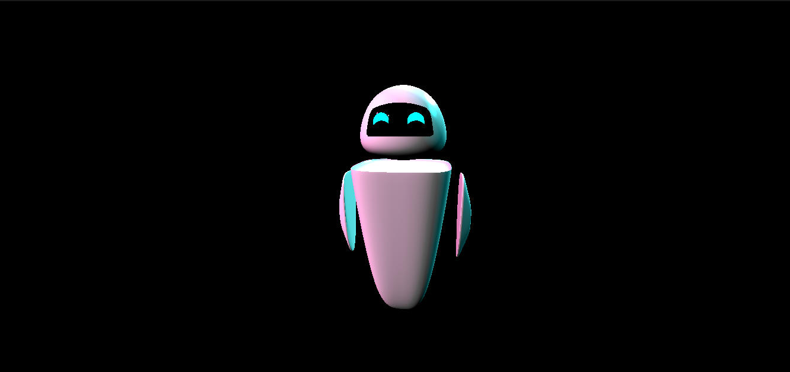

Eve Robot Explorer
---------

Webpack setup courtesy of Bruno Simon of https://threejs-journey.xyz/

I made this as an 'intro' project to learn how to use the [Three.js](https://threejs.org) library. 

Having learned CAD modelling, I wanted to get my designs on the web. So I published this 'funky' design of Eve from Wall-E! (Wall-E is my favourite animated movie :D)

You can check out the model yourself [here](https://madhav-malhotra.github.io/Eve-Robot-Explorer) if you'd like :-)

